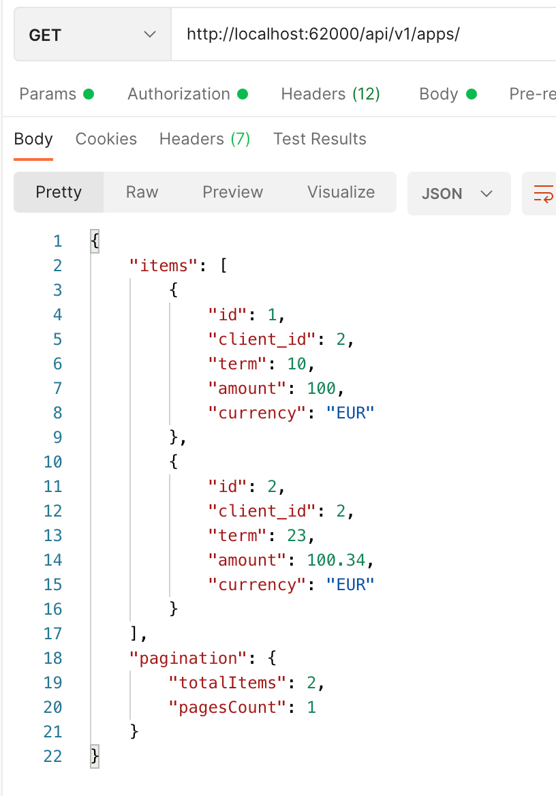

Test project
==================================

## Hosts within your environment ##

Service|Hostname|Port number
------|---------|-----------
php-fpm|php-fpm|9000
Postgres|postgres|5432 (default)

# Steps for run this project #
* Start all containers: `docker-compose up -d`
* Enter into container: `docker exec -i -t  test_php-fpm_1  /bin/bash`
* Run this command for get all depends: `composer install`
* Create database : `php bin/console doctrine:database:create`
* Create schema: `php bin/console  doctrine:schema:create`
* See http://localhost:62000

# Map of endpoints for api v1 #

Name|Method|Path
------|---------|-----------
app_create|POST|`/api/v1/apps/create`
app_find|GET|`/api/v1/apps/{id}`
app_delete|DELETE|`/api/v1/apps/{id}`
apps_list|GET|`/api/v1/apps/`
app_edit|PUT|`/api/v1/apps/{id}`
client_create|POST|`/api/v1/clients/create`
client_find|GET|`/api/v1/clients/{id}`
client_list|GET|`/api/v1/clients/`
client_delete|DELETE|`/api/v1/clients/{id}`
client_edit|PUT|`/api/v1/clients/{id}`

# Test scenario #
##  Client ##
* Create a client

  
* Get a client

  
* List of clients

* Delete a client

* Edit a client

##  Application ##
* Create an app

* Get an app

* List of apps

  
* Delete an app

* Edit an app
  